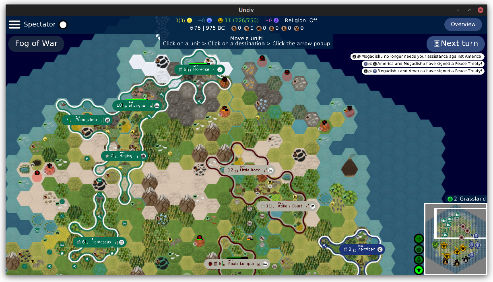

Example mod for custom empire border graphics.

Note that this mod both overrides FantasyHex and brings in its own tileset; You really only need to do one.

This work is licensed under CC-BY-4.0.

---

#### Border Examples Set:

* [**Sleek**](https://github.com/will-ca/Sleek-Borders-Example)
* [**Bubbly**](https://github.com/will-ca/Bubbly-Borders-Example)
* [**Greasy**](https://github.com/will-ca/Greasy-Borders-Example)
* [**Sketchy**](https://github.com/will-ca/Sketchy-Borders-Example)
